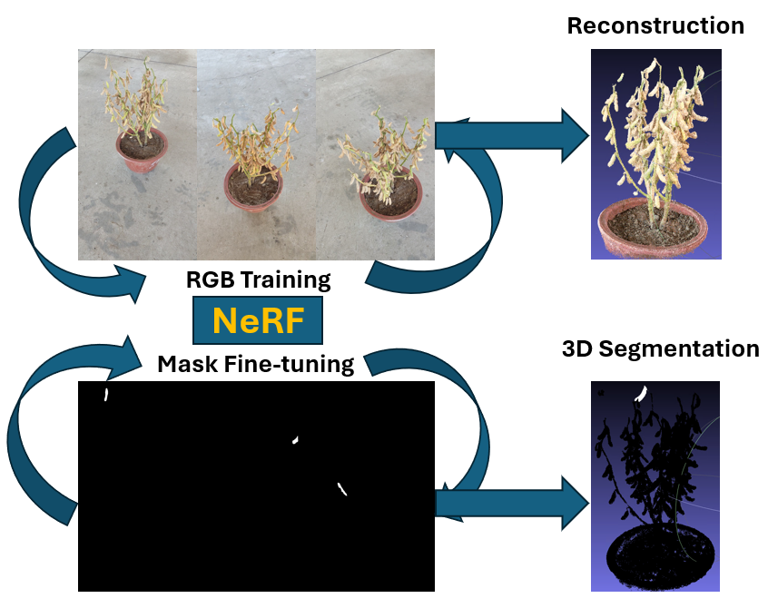

# InvNeRF-Seg

Code and experiment artifacts for the manuscript:

**A Two-Stage Fine-Tuning Strategy for 3D Object Segmentation from Multi-View Images**

InvNeRF-Seg fine-tunes NeRF representations for 3D object segmentation from posed multi-view imagery. The current repository snapshot preserves the experiment scripts, camera metadata, IoU logs, and manuscript/result figures used for the submitted Smart Agricultural Technology manuscript.



## Repository Layout

```text
assets/figures/       Manuscript and experiment figures.
data/                 Camera-pose metadata for the local datasets.
docs/                 Inventories for included files and external artifacts.
results/iou_logs/     Pickled IoU convergence logs used by plotting scripts.
scripts/experiments/  Training, ablation, plotting, and point-cloud scripts.
```

Large trained checkpoints (`.pth`), dense point clouds (`.ply`), source images, masks, and mesh files are not committed because several files exceed GitHub's normal file-size limits. See [docs/artifacts.md](docs/artifacts.md) and [docs/artifact_inventory.csv](docs/artifact_inventory.csv) for the local artifact inventory.

## Included Experiments

The scripts cover these experiment groups:

- InvNeRF-Seg training for apple, peach, and soybean scenes.
- Two-stage fine-tuning ablations: full fine-tuning, mask-only, fine-tune color while freezing density, and fine-tune density while freezing color.
- FruitNeRF and SA3D comparison baselines.
- IoU convergence plotting.
- 3D point-cloud generation, clustering, and counting.

The scripts were copied from the reproducibility workspace and still expect the datasets/checkpoints to be available beside the script or through the paths configured inside each script.

## Environment

The experiments are built around Python, PyTorch, Nerfstudio, Open3D, OpenCV, NumPy, Matplotlib, Pillow, Rich, and jaxtyping. A minimal dependency list is provided in [requirements.txt](requirements.txt), but GPU/CUDA and Nerfstudio installation should follow the versions used by your local training environment.

```powershell
python -m venv .venv
.\.venv\Scripts\Activate.ps1
pip install -r requirements.txt
```

## Reproducing Local Runs

1. Place the full datasets under directories matching the scene names in `data/`:
   `appleTree`, `appleTreeSeg`, `peachTree`, `peachTreeSeg`, `soybeanRGB`, and `soybeanRGBSeg`.
2. Restore trained checkpoints and generated point-cloud files from the external artifact bundle described in [docs/artifacts.md](docs/artifacts.md).
3. Run the relevant script from `scripts/experiments/` in a CUDA-enabled environment.

Example:

```powershell
cd scripts/experiments
python fruits_invNerfSeg_defaultSetting_defaultConfig_April2026_001.py
```

## Data Availability

Only `transforms.json` camera metadata is included in this repository. Image frames, masks, pretrained checkpoints, and point-cloud outputs should be released through an external archive or GitHub Release assets if appropriate.

The apple and peach scenes used in the experiments are derived from the publicly available FruitNeRF dataset. Please cite the FruitNeRF paper and dataset when using those scenes:

- FruitNeRF paper: <https://arxiv.org/abs/2408.06190>
- FruitNeRF dataset archive: <https://zenodo.org/records/10869455>

The soybean scenes are self-collected data from this InvNeRF-Seg study.

## Citation

The manuscript is under review. Please cite this repository and the paper title until a final DOI/citation is available.
